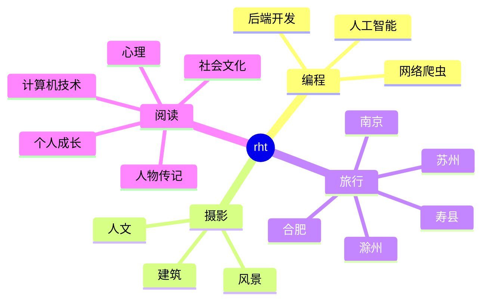

<div align="center">
  
  <!-- dynamic typing effect 动态打字效果 -->
  <div align="center">
    <a href="https://blog.sunguoqi.com/">
      
    </a>
  </div>

  <!-- knock code pictures 敲代码的图片 -->
  <br>

  <!-- profile logo 个人资料徽标 -->
  <div align="center">
    <a href="https://blog.csdn.net/m0_56253883"></a>&emsp;
    <a href="https://blog.csdn.net/m0_56253883"></a>&emsp;
    <a href="https://blog.csdn.net/m0_56253883"></a>&emsp;
    <a href="https://blog.csdn.net/m0_56253883"></a>&emsp;
    <a href="https://blog.csdn.net/m0_56253883"></a>&emsp;
    <!-- visitor statistics logo 访客数统计徽标 -->
    
  </div>

  <!-- Snake Code Contribution Map 贪吃蛇代码贡献图 -->
<picture>
  <source media="(prefers-color-scheme: dark)" srcset="https://cdn.jsdelivr.net/gh/sun0225SUN/sun0225SUN/profile-snake-contrib/github-contribution-grid-snake-dark.svg" />
  <source media="(prefers-color-scheme: light)" srcset="https://cdn.jsdelivr.net/gh/sun0225SUN/sun0225SUN/profile-snake-contrib/github-contribution-grid-snake.svg" />
  
</picture>

</div>

#  🙋 Hello

<table>
<tr><td>

<!-- About me 关于我 -->
### 🤺 About Me


<p>&emsp;&emsp;大家好，我是rht。</p>
<p>&emsp;&emsp;热爱编程、历史、游戏。</p>
<p>&emsp;&emsp;热爱计算机科学和IT互联网事业，励志成为一名优秀的独立开发者。</p>
<p>&emsp;&emsp;我们正在让这个世界变得更加美好，通过代码的重复使用和延展构建完美体系。</p>
<p><strong>&emsp;&emsp;We're making the world a better place. Through constructing elegant hierarchies for maximum code reuse and extensibility.</strong></p>

</td></tr>

<tr>
<td>
  

<!-- 近期创作 -->
### 📃 Recent 面经
  


<!-- START_SECTION:blog -->
* <a href='https://www.nowcoder.com/discuss/484043304233861120?sourceSSR=users' target='_blank'>绿盟科技一面</a> - 2023-03-26
* <a href='https://www.nowcoder.com/discuss/485913099464208384?sourceSSR=users' target='_blank'>亚信科技面试</a> - 2023-02-25
* <a href='https://www.nowcoder.com/discuss/477763903657725952?sourceSSR=users' target='_blank'>格灵深瞳面试</a> - 2023-01-30
* <a href='https://www.nowcoder.com/discuss/477927412387401728?sourceSSR=users' target='_blank'>松鼠ai面试</a> - 2023-01-29

<!-- END_SECTION:blog -->

</td></tr>

<tr><td>

### 🧠 Second jianshu


<!-- START_SECTION:brain -->
* <a href='https://www.jianshu.com/p/0a6a22900de5' target='_blank'>避免伪内存</a> - 2023-07-04
* <a href='https://www.jianshu.com/p/a9025250fb6d' target='_blank'>磁盘比内存慢几万倍？</a> - 2023-06-25
* <a href='https://www.jianshu.com/p/9b51d11b24bc' target='_blank'>CPU执行顺序</a> - 2023-06-25
* <a href='https://www.jianshu.com/p/5b618140fbea' target='_blank'>世界上最爱你的人</a> - 2020-01-01
* <a href='https://www.jianshu.com/p/dd75d04eb243' target='_blank'>古都</a> - 2023-06-20
<!-- END_SECTION:brain -->

</td></tr>

<tr><td>

### 🤾‍♂️ Funny Soul


<!-- START_SECTION:douban -->
* <a href='https://book.douban.com/subject/35193035/' target='_blank'>认知觉醒</a> 🌟🌟🌟🌟🌟 力荐- 2023-04-17
* <a href='http://movie.douban.com/subject/1292052/' target='_blank'>肖申克的救赎</a> 🌟🌟🌟🌟🌟 力荐- 2023-02-07
* <a href='http://movie.douban.com/subject/1292365/' target='_blank'>活着</a> 🌟🌟🌟🌟🌟 力荐- 2023-02-07
* <a href='https://music.douban.com/subject/26567580/' target='_blank'>假如爱有天意</a> 🌟🌟🌟🌟🌟 力荐- 2023-02-07
* <a href='http://movie.douban.com/subject/35465232/' target='_blank'>狂飙</a> 🌟🌟🌟🌟🌟 力荐- 2023-02-07
<!-- END_SECTION:douban -->

</td></tr>

<tr><td>

<!-- wakatime 统计 -->
### 📊 WakaTime

<picture>
  <source
    srcset="https://github-readme-stats.vercel.app/api/wakatime?username=sun0225SUN&layout=compact&text_color=f0f6fc&bg_color=00000000&hide_border=true&hide_title=true"
    media="(prefers-color-scheme: dark)"
  />
  <source
    srcset="https://github-readme-stats.vercel.app/api/wakatime?username=sun0225SUN&layout=compact&text_color=1f2328&bg_color=00000000&hide_border=true&hide_title=true"
    media="(prefers-color-scheme: light), (prefers-color-scheme: no-preference)"
  />
  
</picture>

</td></tr>

<tr><td>

<!--START_SECTION:waka-->
**I'm an Early 🐤** 

```text
🌞 Morning                279 commits         █████░░░░░░░░░░░░░░░░░░░░   19.48 % 
🌆 Daytime                455 commits         ████████░░░░░░░░░░░░░░░░░   31.77 % 
🌃 Evening                508 commits         █████████░░░░░░░░░░░░░░░░   35.47 % 
🌙 Night                  190 commits         ███░░░░░░░░░░░░░░░░░░░░░░   13.27 % 
```
📅 **I'm Most Productive on Friday** 

```text
Monday                   207 commits         ████░░░░░░░░░░░░░░░░░░░░░   14.46 % 
Tuesday                  182 commits         ███░░░░░░░░░░░░░░░░░░░░░░   12.71 % 
Wednesday                187 commits         ███░░░░░░░░░░░░░░░░░░░░░░   13.06 % 
Thursday                 150 commits         ███░░░░░░░░░░░░░░░░░░░░░░   10.47 % 
Friday                   406 commits         ███████░░░░░░░░░░░░░░░░░░   28.35 % 
Saturday                 154 commits         ███░░░░░░░░░░░░░░░░░░░░░░   10.75 % 
Sunday                   146 commits         ███░░░░░░░░░░░░░░░░░░░░░░   10.20 % 
```


📊 **This Week I Spent My Time On** 

```text
🕑︎ Time Zone: Asia/Shanghai

💬 Programming Languages: 
Markdown                 2 hrs 10 mins       ████░░░░░░░░░░░░░░░░░░░░░   17.92 % 
JavaScript               2 hrs 7 mins        ████░░░░░░░░░░░░░░░░░░░░░   17.44 % 
Vue.js                   1 hr 44 mins        ████░░░░░░░░░░░░░░░░░░░░░   14.34 % 
YAML                     1 hr 17 mins        ███░░░░░░░░░░░░░░░░░░░░░░   10.60 % 
CSS                      1 hr 16 mins        ███░░░░░░░░░░░░░░░░░░░░░░   10.48 % 

🔥 Editors: 
VS Code                  9 hrs 58 mins       █████████████████████░░░░   82.04 % 
IntelliJ                 1 hr 46 mins        ████░░░░░░░░░░░░░░░░░░░░░   14.53 % 
Obsidian                 25 mins             █░░░░░░░░░░░░░░░░░░░░░░░░   03.43 % 

💻 Operating System: 
Windows                  11 hrs 12 mins      ███████████████████████░░   92.18 % 
Mac                      57 mins             ██░░░░░░░░░░░░░░░░░░░░░░░   07.82 % 
```


 Last Updated on 06/07/2023 01:55:43 UTC
<!--END_SECTION:waka-->
  
</td></tr>
</table>

<!-- ########################################## 分割 ########################################## -->


<div align="center" >



<!-- just img 图片 -->


<!--  skill badge 技能徽章 -->
💪 正在学习


  
🧠 计划学习


🧰 常用的工具


<!-- programming tool icon 编程工具图标 -->
<br>

<!-- svg -->


 


<br>

<!-- gif -->


<div align="center" >


  
<!-- Quotes 名人名言 -->
<br>
  
<!-- GitHub 奖杯🏆 -->
<br>

<!-- GitHub 数据统计 -->

<br><br>

<!-- Awesome repo 比较好的仓库-->
<a href="https://github.com/sun0225SUN/Awesome-Love-Code">
</a>
<a href="https://github.com/sun0225SUN/Student-Data-Vision">
</a><br><br>
  
<!-- Wakatime Graph-->
<table>
  <tr>
    <td></td>
    <td></td>
  </tr>
  <tr>
    <td colspan="2"><a href="https://run.sunguoqi.com"></a><br></td>
  </tr>
</table>
</div>

<!-- ########################################## 分割 ########################################## -->


<div align="center">

<!-- run 图片 -->


<!-- Joke 笑话 -->
<div></div>

<!-- github-readme-streak-stats 连续提交代码天数记录 -->
&emsp;

&emsp;

<!-- Spotify 音乐 -->
<!-- &emsp;&emsp;&emsp;&emsp;

  &emsp;&emsp;&emsp;&emsp; -->

<!-- metrics 基础资料 -->
&emsp;

&emsp;

<!-- My Blog 博客首页 -->
&emsp;
<a href="https://blog.sunguoqi.com"></a>
&emsp;

<!-- GitHub Activity Graph GitHub 活动图 -->
<table align="center">
  <tr>
    <td></td>
  </tr>
</table>

</div>

<!-- ########################################## 分割 ########################################## -->


<!-- GitHub metrics 信息指标 -->
<div align="center">

<!-- just img 图片 -->


<!-- first form 第一个表格 -->
<table>
  <tr>
    <td></td>
  </tr>
</table>

<!-- second form 第二个表格 -->
<table>
  <tr>
    <td></td>
    <td></td>
  </tr>
  <tr>
    <td></td>
    <td></td>
  </tr>
  <tr>
    <td></td>
    <td></td>
  </tr>
  <tr>
    <td></td>
    <td></td>
  </tr>
  <tr>
    <td></td>
    <td></td>
  </tr>
  <tr>
    <td></td>
    <td></td>
  </tr>
  <tr>
    <td></td>
    <td></td>
  </tr>
</table>


<!-- just img 图片 -->

</div>
